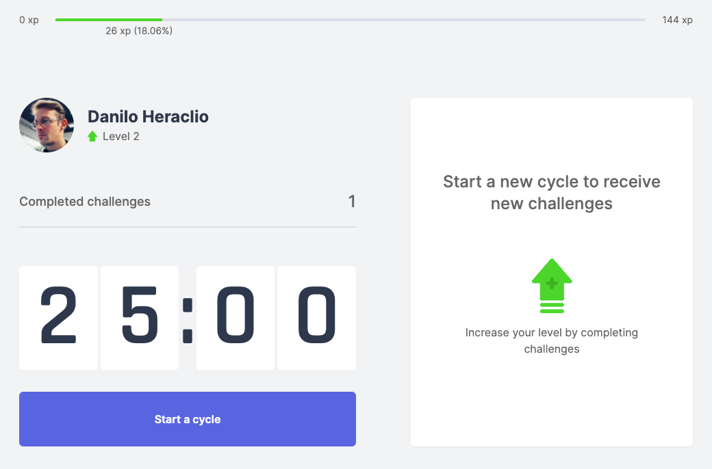
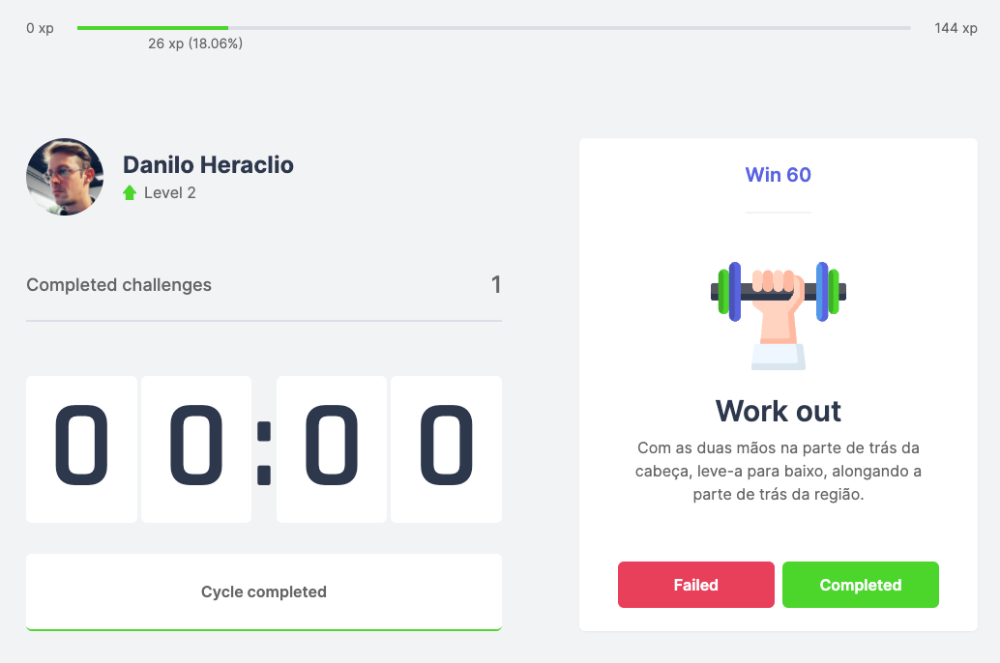
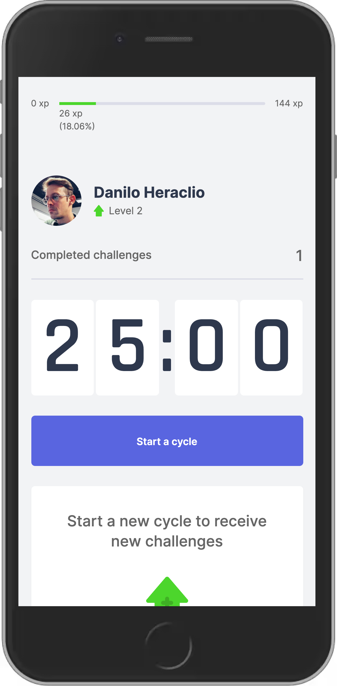

<p align="center">
  
</p>

Application built during Nuxt Levue Week promoted on Maiatto Dev channel. [Maiatto Dev](https://www.youtube.com/channel/UCWRzzG0D8OwMVu6FKKpHzIA).

You can check the demo in: [DEMO](https://movueit-nuxt-rho.vercel.app/)

# Movue It

Movue It is an application that lets you perform the Pomodoro technique to stimulate focus during a working day. At the end of each period, a challenge will be proposed to take a break for rest and exercise.

Move It is an application originally developed during Next Level Week, promoted by [Rocketseat](https://rocketseat.com.br/) and adapted for VueJs (with [NuxtJs](https://nuxtjs.org/)) by [Rafael Maia Chieregatto](https://github.com/rafaelmaiach).

---

# Screenshots

### Starting



### Time out



### Mobile - Mobile

<p align="center">
  
</p>

---

# Technologies

This project was developed using [VueJs](https://vuejs.org/), [NuxtJs](https://nuxtjs.org/), [TailwindCSS](https://tailwindcss.com/) and the concept of Atomic Design [Atomic Design](https://bradfrost.com/blog/post/atomic-web-design/). In order to play around/learn nuxt

---

# Executando o projeto

## Requirement

Before starting, you must have the tools installed. [Git](https://git-scm.com/), [Node.js](https://nodejs.org/en/) and a code editor of your choice.

### Running the application

```
  # Clone this repo
  $ git clone https://github.com/daniloheraclio/movueit.git

  # Jump in the movueit directory
  $ cd movueit

  # Install dependencies
  $ npm install (or yarn install)

  # Run in dev mode
  $ npm run dev (or yarn dev )

  # Open in your browser http://localhost:3000
```

# Author


[Danilo Heraclio](https://github.com/daniloheraclio)

**&copy;** [MaiattoDev](https://www.youtube.com/watch?v=VbkFOWw4yeY&list=PL6GSB1I1APjqS1ligyQwHeVT0sAOWNkWH&ab_channel=MaiattoDev)

### Licença

[MIT](https://github.com/ederwms/movueit/blob/main/LICENSE)
